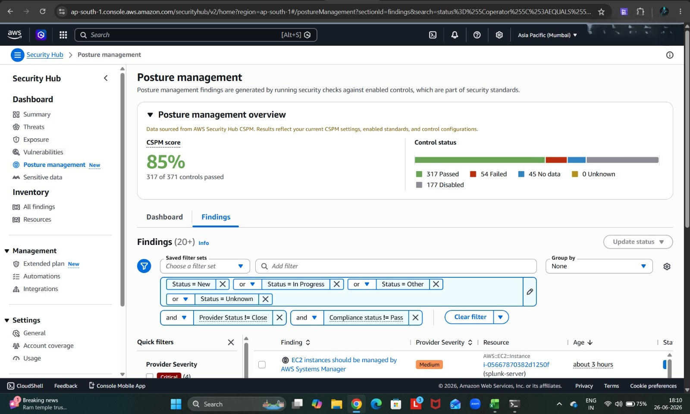

# 🛠️ CIS AWS Foundations Benchmark v1.2.0 — Remediation Runbook

This is the full step-by-step record of hardening a live personal AWS account (`ap-south-1`) against the **CIS AWS Foundations Benchmark v1.2.0**, tracked end-to-end through **AWS Security Hub**. Every control below was remediated manually through the AWS Management Console — no CLI, no IaC — so each change could be verified visually against Security Hub before moving to the next.

> 📌 **A note on the two scores you'll see throughout this runbook:**
> Security Hub reports two different numbers that both improved over the course of this project:
> - **CSPM Score** — the blended posture score across *all* enabled standards (CIS + AWS Foundational Security Best Practices + others). General hardening (e.g. S3 public access, GuardDuty, default security groups) moves this number.
> - **CIS Score** — the score for the **CIS AWS Foundations Benchmark v1.2.0 standard specifically**. This is the one that matters most for this project and is driven almost entirely by the IAM, KMS, CloudTrail, and CloudWatch controls below.

---

## 📍 Baseline Assessment

Before any remediation, Security Hub was reviewed to understand the starting posture and prioritize controls by severity.

| Evidence | What it shows |
|---|---|
|  | Baseline CSPM score: **85%** (317 of 371 controls passed, 54 failed) |
|  | Critical-severity findings (root MFA, SSM public sharing, unrestricted security groups) |
|  | High-severity findings (public EC2/EBS exposure, permissive security groups, CloudTrail gaps) |
|  | Medium-severity findings (SSM management, EBS encryption, S3 logging, IAM MFA) |
|  | Low-severity findings — this is where all 13 CloudWatch log metric filter/alarm controls (CIS section 3.x) surfaced |
|  | Informational-severity findings |
|  | Standards dashboard — CIS AWS Foundations Benchmark v1.2.0 sitting at a much lower score than AWS FSBP, confirming CIS-specific controls needed the most work |
|  | **CIS AWS Foundations Benchmark v1.2.0 score specifically: 29%** (12 of 41 controls passed) — this is the true starting point for the CIS-specific remediation tracked below |

---

## 🧰 Supplementary AWS FSBP Hardening

A few general hardening items were addressed alongside the CIS-specific work. These aren't CIS AWS Foundations Benchmark v1.2.0 controls themselves, but they improved the overall CSPM posture score in parallel:

| Evidence | What it shows |
|---|---|
|  | Account-level S3 Block Public Access settings confirmed enabled across all four sub-settings |
|  | Amazon GuardDuty enabled for continuous threat detection |
|  | Default VPC security group's inbound/outbound rules cleared, closing the "default security group allows traffic" finding |

---

## 🔑 IAM

| Control | Evidence | What was done |
|---|---|---|
| `IAM.11–17` |  | Account password policy hardened — minimum length ≥ 14, complexity, reuse prevention, and expiration enabled |
| — |  | MFA enrolled on the `splunk-ec2-user` service account used by the home-lab Splunk EC2 instance |
| — |  | Directly-attached IAM policies migrated to a dedicated `splunk-ec2-user-group`; user-level attachments removed so all permissions are now managed at the group level |
| `IAM.18` |  | Dedicated `AWSSupportAccessRole` created for support-case access, avoiding root or admin credential use |

---

## 🔐 KMS

| Control | Evidence | What was done |
|---|---|---|
| `KMS.4` |  | Automatic annual key rotation enabled on the customer-managed KMS key (`cis-cloudtrail-key`) used to encrypt CloudTrail logs |

---

## 🖥️ EC2 / VPC

| Control | Evidence | What was done |
|---|---|---|
| `EC2.6` |  | VPC Flow Logs enabled, closing out the previously open EC2.6 finding |

---

## 🧭 CloudTrail

| Control | Evidence | What was done |
|---|---|---|
| — |  | Multi-region trail `cis-org-trail` confirmed active, with SSE-KMS encryption and log file validation enabled |
| `CloudTrail.5` |  | CloudTrail wired to deliver into a CloudWatch Logs log group (`aws-cloudtrail-logs-894759051479-758c27c5`) — a **prerequisite** for every CloudWatch.2–.14 metric filter, since they all read from this log group |
| `CloudTrail.7` |  | S3 access logging enabled on the CloudTrail bucket, with logs delivered to a dedicated `s3-access-logs` bucket (SSE-encrypted) |

---

## ⭐ CloudWatch — Log Metric Filters & Alarms

The core of this project: 13 log metric filter + alarm controls (CIS section 3.x, surfaced in Security Hub as `CloudWatch.2`–`.14`). Each follows the same pattern:

```
Metric filter  →  aws-cloudtrail-logs-894759051479-758c27c5   (CloudTrail-fed log group)
Custom metric  →  CISBenchmark namespace
Alarm          →  CIS-3.x-<ShortName>  →  cis-cloudtrail-alarms (SNS topic)
```

First, the shared SNS topic that every alarm below notifies:

| Evidence | What it shows |
|---|---|
|  | `cis-cloudtrail-alarms` SNS topic — the shared notification target for all 13 CloudWatch alarms |

### Controls remediated with evidence

| Control | Detects | Metric filter evidence | Alarm evidence |
|:---|:---|:---|:---|
| `CloudWatch.2` | Unauthorized API calls |  |  |
| `CloudWatch.3` | Console sign-in without MFA |  |  |
| `CloudWatch.4` | Root account usage |  | *(combined in same screenshot)* |
| `CloudWatch.5` | IAM policy changes |  |  |
| `CloudWatch.6` | CloudTrail configuration changes |  | *(combined in same screenshot)* |
| `CloudWatch.7` | Console sign-in failures |  |  |
| `CloudWatch.8` | Disabling/scheduled deletion of CMKs |  |  |
| `CloudWatch.9` | S3 bucket policy changes |  | *(combined in same screenshot)* |

### Controls remediated (same pattern, not separately screenshotted)

| Control | Detects |
|:---|:---|
| `CloudWatch.10` | AWS Config configuration changes |
| `CloudWatch.11` | Security group changes |
| `CloudWatch.12` | Network ACL (NACL) changes |
| `CloudWatch.13` | Network gateway changes |
| `CloudWatch.14` | Route table changes |

> *These five followed the identical metric filter → alarm → SNS pattern shown above and are reflected in the final Security Hub score.*

---

## 📊 Progress Checkpoints

Security Hub was re-scanned after each batch of remediation to confirm improvement before moving to the next control. Note the **two separate score tracks** described at the top of this runbook.

### CSPM Score (blended, all standards)

| Stage | Evidence | Score |
|---|---|---|
| Baseline | [see above](#-baseline-assessment) | 85% |
| Checkpoint 1 |  | 87% |
| Checkpoint 2 |  | 91% |
| Checkpoint 3 |  | 92% |
| Checkpoint 4 |  | 93% |
| **Final** |  | **95%** |

### CIS AWS Foundations Benchmark v1.2.0 Score (CIS-specific)

| Stage | Evidence | Score |
|---|---|---|
| Baseline |  | 29% |
| Checkpoint 1 |  | 61% |
| Checkpoint 2 |  | 68% |
| Checkpoint 3 |  | 80% |
| **Final** |  | **98%** |

> Security Hub findings refresh on a 12–24 hour cycle, so scores were re-checked the following day after each batch of fixes to avoid reacting to stale data.

---

## ✅ Results Summary

| Metric | Before | After |
|---|:---:|:---:|
| CSPM Score (all standards) | 85% | **95%** |
| CIS AWS Foundations Benchmark v1.2.0 Score | 29% | **98%** |
| Failed CIS controls | 29 of 41 | 1 *(pending refresh)* |

---

